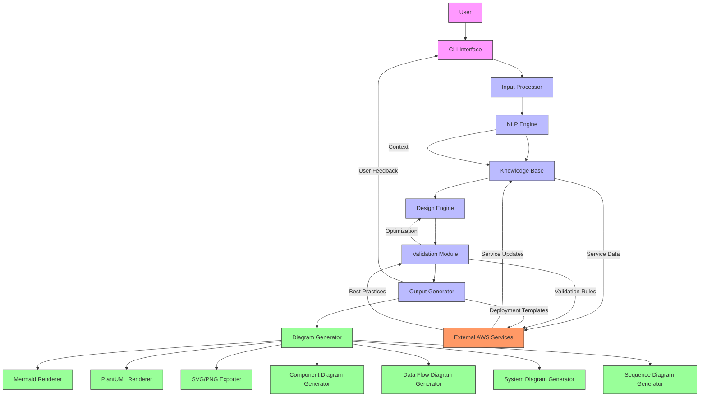
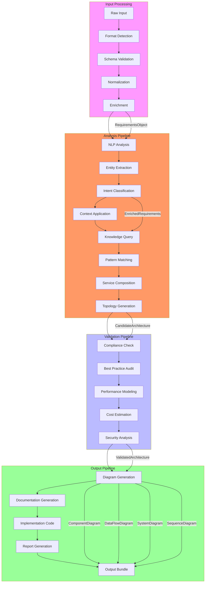
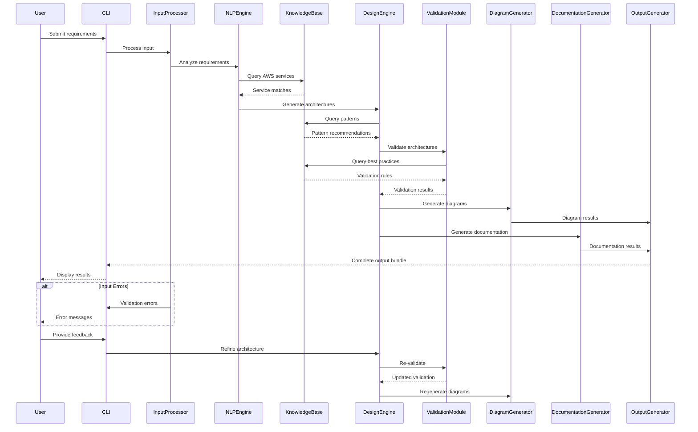
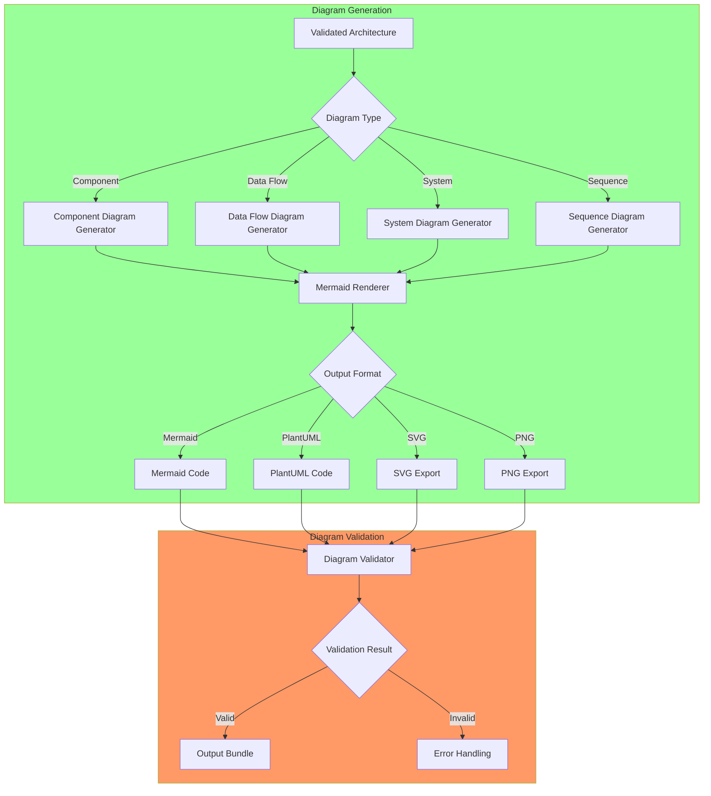
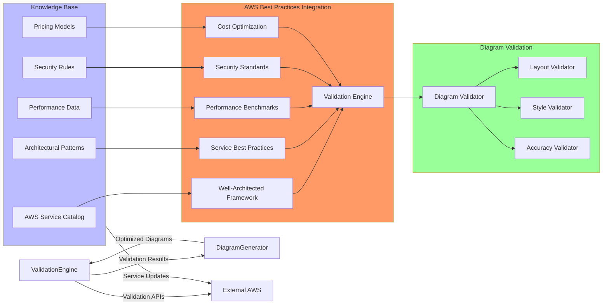
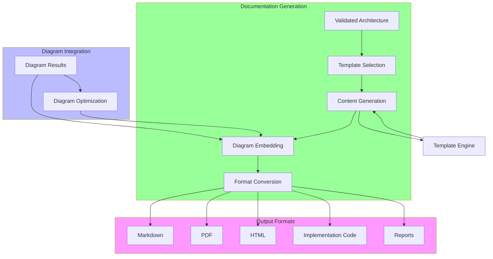

# AWS Architecture Agent - Detailed Architecture Diagrams

## 1. Component Architecture Diagram

```mermaid
classDiagram
    class InputProcessor {
        +detectFormat(input: string)
        +validate(input: string, format: InputFormat)
        +normalize(input: string, format: InputFormat)
        +enrich(requirements: RequirementsObject)
    }

    class NLPEngine {
        +analyzeText(text: string)
        +extractEntities(text: string)
        +classifyIntent(text: string)
        +applyContext(requirements: RequirementsObject)
    }

    class KnowledgeBase {
        +queryServices(requirements: RequirementsObject)
        +getPatterns(context: ArchitectureContext)
        +validateConstraints(architecture: CandidateArchitecture)
    }

    class DesignEngine {
        +generateArchitectures(requirements: EnrichedRequirements)
        +selectPatterns(requirements: RequirementsObject)
        +composeServices(pattern: ArchitecturalPattern, requirements: RequirementsObject)
        +generateTopology(composition: ServiceComposition)
    }

    class ValidationModule {
        +validateArchitecture(architecture: CandidateArchitecture)
        +checkCompliance(architecture: CandidateArchitecture)
        +auditBestPractices(architecture: CandidateArchitecture)
        +modelPerformance(architecture: CandidateArchitecture)
        +estimateCosts(architecture: CandidateArchitecture)
    }

    class DiagramGenerator {
        +generateArchitectureDiagram(architecture: ValidatedArchitecture)
        +generateComponentDiagram(components: AWSComponent[])
        +generateDataFlowDiagram(dataFlows: DataFlow[])
        +generateSequenceDiagram(interactions: ComponentInteraction[])
        +renderMermaid(diagram: MermaidDiagram)
        +renderPlantUML(diagram: PlantUMLDiagram)
    }

    class DocumentationGenerator {
        +generateDocumentation(architecture: ValidatedArchitecture)
        +generateMarkdown(architecture: ValidatedArchitecture)
        +generatePDF(architecture: ValidatedArchitecture)
        +generateHTML(architecture: ValidatedArchitecture)
        +embedDiagrams(documentation: string, diagrams: DiagramResult[])
    }

    class OutputGenerator {
        +generateOutputs(architecture: ValidatedArchitecture)
        +generateImplementation(architecture: ValidatedArchitecture)
        +generateReports(architecture: ValidatedArchitecture)
    }

    %% Relationships
    InputProcessor --> NLPEngine : processes → analyzes
    NLPEngine --> KnowledgeBase : queries → provides knowledge
    NLPEngine --> DesignEngine : analyzes → generates
    DesignEngine --> KnowledgeBase : queries → provides patterns
    DesignEngine --> ValidationModule : generates → validates
    ValidationModule --> DiagramGenerator : validates → generates diagrams
    ValidationModule --> DocumentationGenerator : validates → generates docs
    DiagramGenerator --> OutputGenerator : generates → includes
    DocumentationGenerator --> OutputGenerator : generates → includes

    %% Composition
    OutputGenerator *-- DiagramGenerator : contains
    OutputGenerator *-- DocumentationGenerator : contains

    %% Style
    class InputProcessor,NLPEngine,KnowledgeBase,DesignEngine,ValidationModule fill:#f9f
    class DiagramGenerator,DocumentationGenerator,OutputGenerator fill:#9f9
```

## 2. Data Flow Architecture Diagram

```mermaid
flowchart LR
    subgraph InputLayer[Input Layer]
        A[User Input] --> B[Format Detection]
        B --> C[Schema Validation]
        C --> D[Normalization]
        D --> E[Enrichment]
    end

    subgraph ProcessingLayer[Processing Layer]
        E --> F[NLP Analysis]
        F --> G[Entity Extraction]
        G --> H[Intent Classification]
        H --> I[Context Application]
        I --> J[Knowledge Query]
        J --> K[Pattern Matching]
        K --> L[Service Composition]
        L --> M[Topology Generation]
    end

    subgraph ValidationLayer[Validation Layer]
        M --> N[Compliance Check]
        N --> O[Best Practice Audit]
        O --> P[Performance Modeling]
        P --> Q[Cost Estimation]
        Q --> R[Security Analysis]
    end

    subgraph OutputLayer[Output Layer]
        R --> S[Diagram Generation]
        S --> T[Documentation Generation]
        T --> U[Implementation Code]
        U --> V[Report Generation]
        V --> W[Output Bundle]
    end

    %% Data Structures Flow
    E -->|RequirementsObject| F
    H -->|EnrichedRequirements| J
    M -->|CandidateArchitecture| N
    R -->|ValidatedArchitecture| S

    %% Diagram Generation Flow
    S -->|ComponentDiagram| W
    S -->|DataFlowDiagram| W
    S -->|SystemDiagram| W
    S -->|SequenceDiagram| W

    %% Style
    style InputLayer fill:#f9f
    style ProcessingLayer fill:#f96
    style ValidationLayer fill:#bbf
    style OutputLayer fill:#9f9
```



## 3. System Architecture Diagram



## 4. Component Diagram

```mermaid
componentDiagram
    %% Main Components
    component UserInterface {
        +CLI Interface
        +Interactive Mode
        +Visualization
    }

    component InputProcessor {
        +Format Detection
        +Schema Validation
        +Normalization
        +Enrichment
    }

    component AnalysisEngine {
        +NLP Engine
        +Knowledge Base
        +Design Engine
    }

    component ValidationEngine {
        +Compliance Validator
        +Best Practice Auditor
        +Performance Modeler
        +Cost Estimator
        +Security Analyzer
    }

    component OutputEngine {
        +Diagram Generator
        +Documentation Generator
        +Implementation Generator
    }

    %% Relationships
    UserInterface --> InputProcessor : sends input
    InputProcessor --> AnalysisEngine : provides requirements
    AnalysisEngine --> ValidationEngine : generates architectures
    ValidationEngine --> OutputEngine : validates architectures
    OutputEngine --> UserInterface : returns output

    %% Diagram Generator Details
    component DiagramGenerator {
        +Component Diagram Generator
        +Data Flow Diagram Generator
        +System Diagram Generator
        +Sequence Diagram Generator
        +Mermaid Renderer
        +PlantUML Renderer
    }

    OutputEngine *-- DiagramGenerator : contains

    %% External Dependencies
    AnalysisEngine --> AWS[External AWS Services] : queries service data
    ValidationEngine --> AWS : queries validation rules
    OutputEngine --> AWS : generates deployment templates

    %% Style
    style UserInterface fill:#f9f
    style InputProcessor fill:#f96
    style AnalysisEngine fill:#bbf
    style ValidationEngine fill:#9f9
    style OutputEngine fill:#ff9
    style DiagramGenerator fill:#9f9
```

## 5. Data Flow Diagram



## 6. Sequence Diagram for Complete Workflow



## 7. Diagram Generation Detailed Flow



## 8. AWS Best Practices Integration Diagram



## 9. Documentation Generation Flow



## 10. Extensibility Architecture

```mermaid
classDiagram
    class DiagramGenerator {
        <<abstract>>
        +generateDiagram()
        +validateDiagram()
        +exportDiagram()
        +registerPlugin()
    }

    class MermaidGenerator {
        +generateMermaidCode()
        +applyMermaidTheme()
        +renderMermaid()
    }

    class PlantUMLGenerator {
        +generatePlantUMLCode()
        +applyPlantUMLStyle()
        +renderPlantUML()
    }

    class CustomDiagramGenerator {
        +generateCustomFormat()
        +applyCustomStyle()
    }

    class InputFormatPlugin {
        <<interface>>
        +detectFormat()
        +parseInput()
        +validateInput()
    }

    class OutputFormatPlugin {
        <<interface>>
        +generateOutput()
        +validateOutput()
        +exportOutput()
    }

    DiagramGenerator <|-- MermaidGenerator
    DiagramGenerator <|-- PlantUMLGenerator
    DiagramGenerator <|-- CustomDiagramGenerator

    DiagramGenerator --> InputFormatPlugin : uses
    DiagramGenerator --> OutputFormatPlugin : uses

    class JSONInputPlugin {
        +detectFormat()
        +parseJSON()
        +validateJSON()
    }

    class YAMLInputPlugin {
        +detectFormat()
        +parseYAML()
        +validateYAML()
    }

    class MarkdownOutputPlugin {
        +generateMarkdown()
        +validateMarkdown()
        +exportMarkdown()
    }

    class PDFOutputPlugin {
        +generatePDF()
        +validatePDF()
        +exportPDF()
    }

    InputFormatPlugin <|-- JSONInputPlugin
    InputFormatPlugin <|-- YAMLInputPlugin
    OutputFormatPlugin <|-- MarkdownOutputPlugin
    OutputFormatPlugin <|-- PDFOutputPlugin

    %% Style
    class DiagramGenerator,InputFormatPlugin,OutputFormatPlugin fill:#f9f
    class MermaidGenerator,PlantUMLGenerator,CustomDiagramGenerator fill:#9f9
    class JSONInputPlugin,YAMLInputPlugin,MarkdownOutputPlugin,PDFOutputPlugin fill:#bbf
```

This comprehensive set of architecture diagrams provides a complete visual representation of the AWS Architecture Agent's diagram generation system, covering all major components, data flows, sequence interactions, and extensibility patterns.