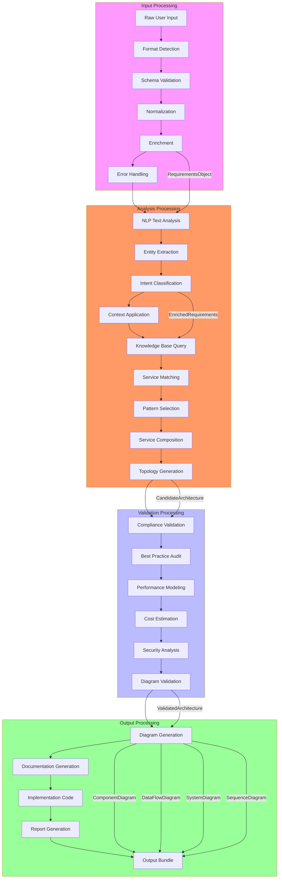
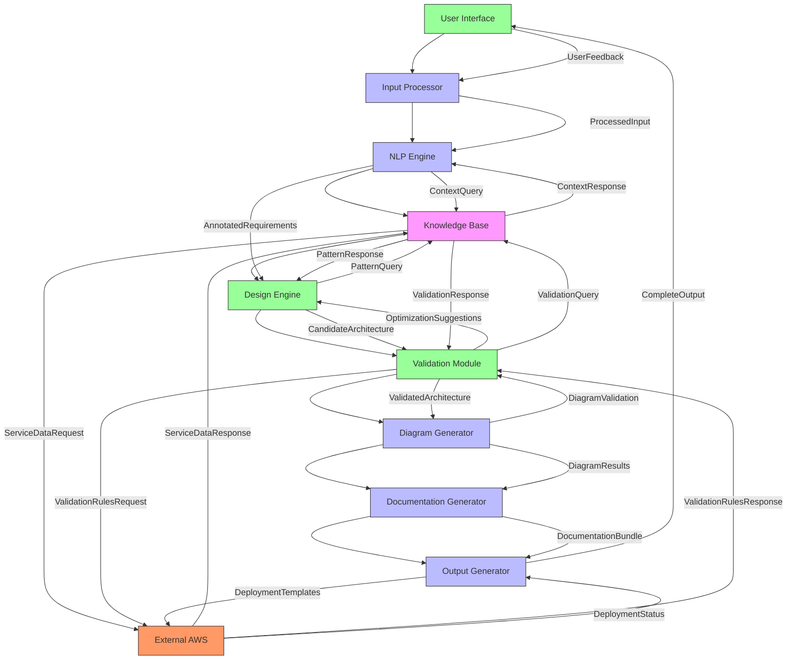
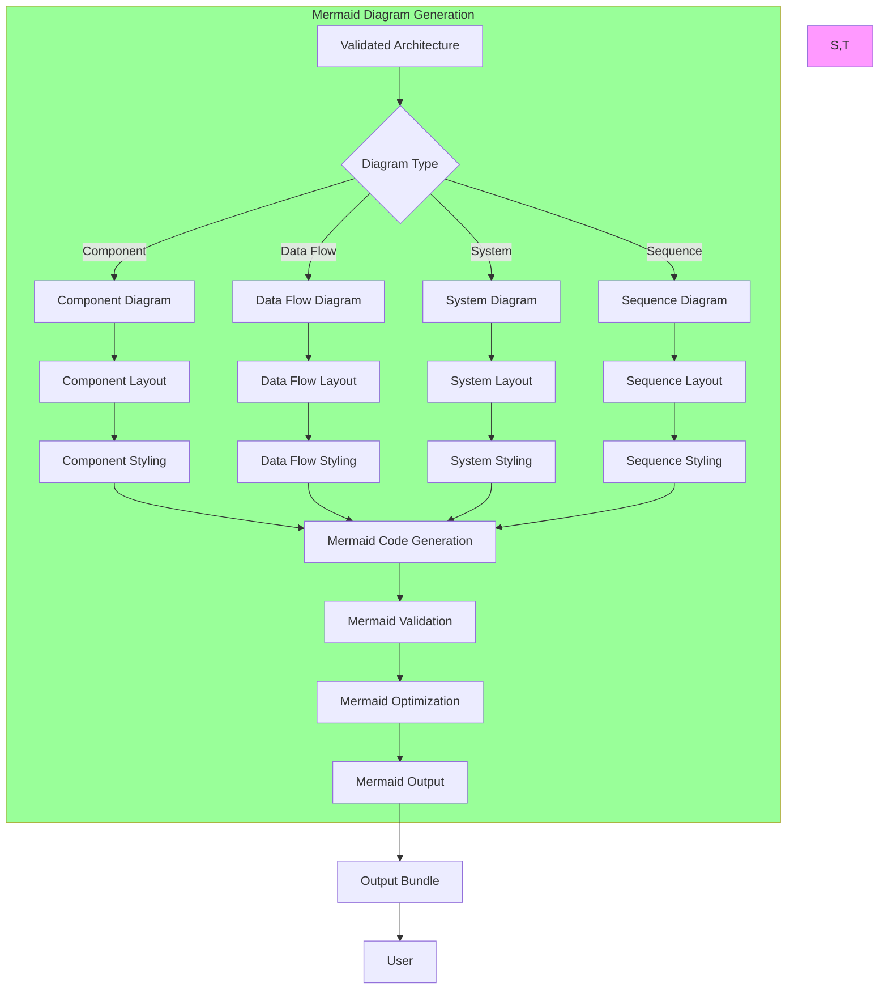
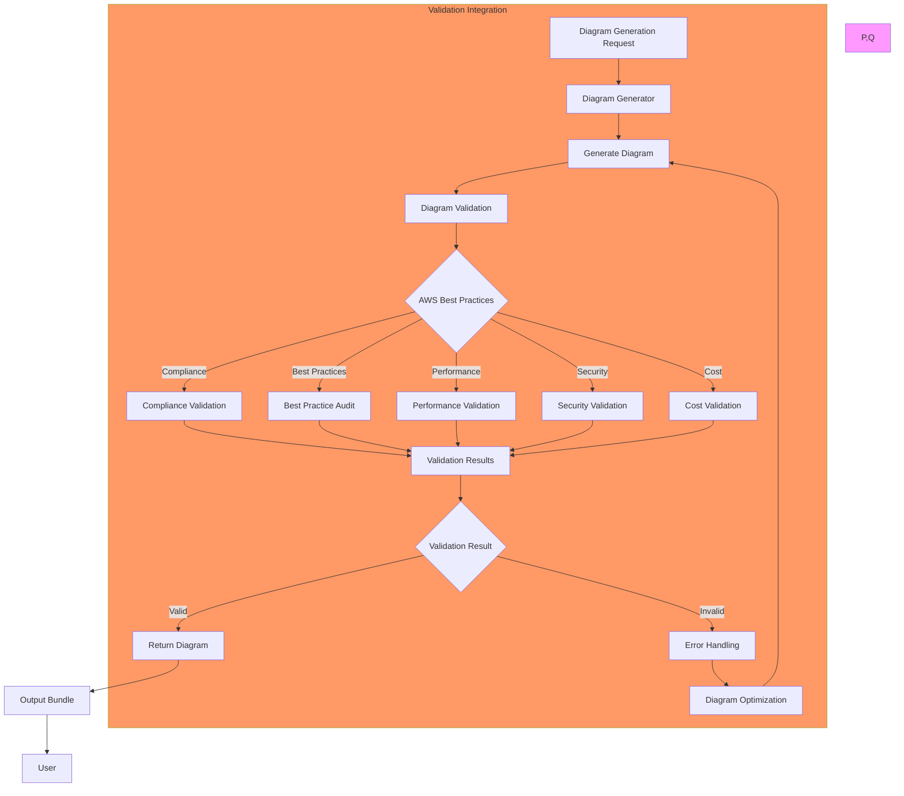
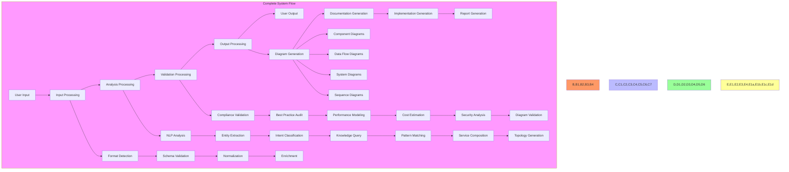
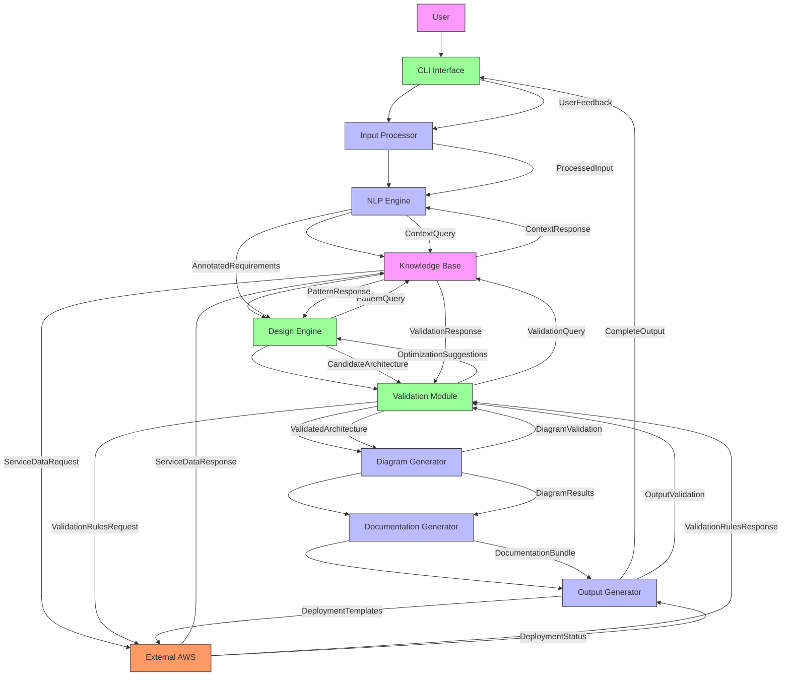
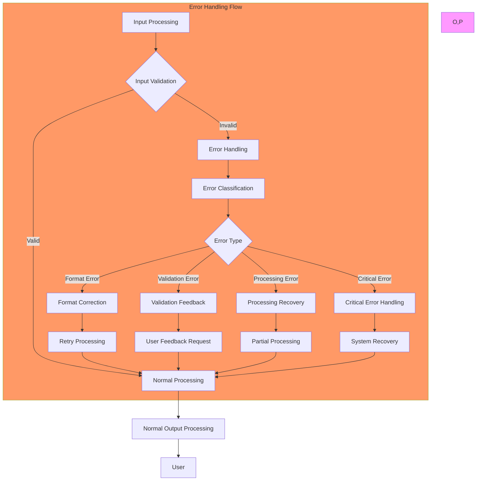

# AWS Architecture Agent - Component and Data Flow Diagrams

## 1. Component Diagram - Detailed View

```mermaid
componentDiagram
    %% Main System Components
    component UserInterface {
        +CLI Interface
        +Interactive Mode
        +Session Management
        +Visualization
    }

    component InputProcessor {
        +FormatDetector
        +SchemaValidator
        +Normalizer
        +Enricher
        +ErrorHandler
    }

    component AnalysisEngine {
        +NLPEngine
        +KnowledgeBase
        +DesignEngine
    }

    component ValidationEngine {
        +ComplianceValidator
        +BestPracticeAuditor
        +PerformanceModeler
        +CostEstimator
        +SecurityAnalyzer
        +DiagramValidator
    }

    component OutputEngine {
        +DiagramGenerator
        +DocumentationGenerator
        +ImplementationGenerator
        +ReportGenerator
    }

    %% Detailed Subcomponents
    component NLPEngine {
        +TextAnalyzer
        +EntityExtractor
        +IntentClassifier
        +ContextApplier
    }

    component KnowledgeBase {
        +ServiceCatalog
        +PatternLibrary
        +ConstraintDatabase
        +QueryInterface
        +UpdateManager
    }

    component DesignEngine {
        +PatternSelector
        +ServiceComposer
        +TopologyGenerator
        +TradeoffAnalyzer
        +AlternativeGenerator
    }

    component DiagramGenerator {
        +ComponentDiagramGenerator
        +DataFlowDiagramGenerator
        +SystemDiagramGenerator
        +SequenceDiagramGenerator
        +MermaidRenderer
        +PlantUMLRenderer
        +SVGExporter
        +PNGExporter
    }

    %% Relationships
    UserInterface --> InputProcessor : sends user input
    InputProcessor --> AnalysisEngine : provides processed requirements
    AnalysisEngine --> ValidationEngine : generates candidate architectures
    ValidationEngine --> OutputEngine : validates and optimizes
    OutputEngine --> UserInterface : returns complete output

    %% Internal Component Relationships
    AnalysisEngine *-- NLPEngine : contains
    AnalysisEngine *-- KnowledgeBase : contains
    AnalysisEngine *-- DesignEngine : contains
    OutputEngine *-- DiagramGenerator : contains

    %% External AWS Integration
    KnowledgeBase --> AWS[External AWS Services] : queries service data
    ValidationEngine --> AWS : queries validation rules
    OutputEngine --> AWS : generates deployment templates

    %% Style
    style UserInterface fill:#f9f
    style InputProcessor fill:#f96
    style AnalysisEngine fill:#bbf
    style ValidationEngine fill:#9f9
    style OutputEngine fill:#ff9
    style NLPEngine,KnowledgeBase,DesignEngine fill:#ddf
    style DiagramGenerator fill:#9f9
```

## 2. Data Flow Diagram - Detailed Processing



## 3. Component Interaction Diagram



## 4. Data Flow Diagram - Mermaid Generation



## 5. Component Diagram - Diagram Generator Focus

```mermaid
componentDiagram
    %% Diagram Generator Components
    component DiagramGenerator {
        +generateDiagram()
        +validateDiagram()
        +exportDiagram()
        +registerPlugin()
    }

    component ComponentDiagramGenerator {
        +generateComponentLayout()
        +renderComponentRelationships()
        +applyComponentStyling()
        +generateMermaidComponent()
        +generatePlantUMLComponent()
    }

    component DataFlowDiagramGenerator {
        +generateDataFlowLayout()
        +renderDataPaths()
        +applyDataFlowStyling()
        +generateMermaidDataFlow()
        +generatePlantUMLDataFlow()
    }

    component SystemDiagramGenerator {
        +generateSystemLayout()
        +renderSystemBoundaries()
        +applySystemStyling()
        +generateMermaidSystem()
        +generatePlantUMLSystem()
    }

    component SequenceDiagramGenerator {
        +generateInteractionTimeline()
        +renderMessageFlows()
        +applySequenceStyling()
        +generateMermaidSequence()
        +generatePlantUMLSequence()
    }

    component MermaidRenderer {
        +renderMermaidCode()
        +applyMermaidTheme()
        +validateMermaidSyntax()
        +optimizeMermaidLayout()
    }

    component PlantUMLRenderer {
        +renderPlantUMLCode()
        +applyPlantUMLTheme()
        +validatePlantUMLSyntax()
        +optimizePlantUMLLayout()
    }

    component SVGExporter {
        +exportToSVG()
        +applySVGStyling()
        +optimizeSVG()
    }

    component PNGExporter {
        +exportToPNG()
        +applyPNGStyling()
        +optimizePNG()
    }

    %% Relationships
    DiagramGenerator *-- ComponentDiagramGenerator : uses
    DiagramGenerator *-- DataFlowDiagramGenerator : uses
    DiagramGenerator *-- SystemDiagramGenerator : uses
    DiagramGenerator *-- SequenceDiagramGenerator : uses
    DiagramGenerator *-- MermaidRenderer : uses
    DiagramGenerator *-- PlantUMLRenderer : uses
    DiagramGenerator *-- SVGExporter : uses
    DiagramGenerator *-- PNGExporter : uses

    %% Style
    style DiagramGenerator fill:#f9f
    style ComponentDiagramGenerator,DataFlowDiagramGenerator,SystemDiagramGenerator,SequenceDiagramGenerator fill:#bbf
    style MermaidRenderer,PlantUMLRenderer fill:#9f9
    style SVGExporter,PNGExporter fill:#ff9
```

## 6. Data Flow Diagram - Validation Integration



## 7. Component Diagram - Complete System Overview

```mermaid
componentDiagram
    %% Complete System Components
    component UserInterface {
        +CLI Interface
        +Interactive Mode
        +Visualization
    }

    component InputProcessing {
        +Format Detection
        +Schema Validation
        +Normalization
        +Enrichment
    }

    component AnalysisProcessing {
        +NLP Engine
        +Knowledge Base
        +Design Engine
    }

    component ValidationProcessing {
        +Compliance Validation
        +Best Practice Audit
        +Performance Modeling
        +Cost Estimation
        +Security Analysis
        +Diagram Validation
    }

    component OutputProcessing {
        +Diagram Generation
        +Documentation Generation
        +Implementation Generation
        +Report Generation
    }

    %% Detailed Subcomponents
    component DiagramGeneration {
        +Component Diagrams
        +Data Flow Diagrams
        +System Diagrams
        +Sequence Diagrams
        +Mermaid Rendering
        +PlantUML Rendering
        +SVG/PNG Export
    }

    %% Relationships
    UserInterface --> InputProcessing : user input
    InputProcessing --> AnalysisProcessing : processed requirements
    AnalysisProcessing --> ValidationProcessing : candidate architectures
    ValidationProcessing --> OutputProcessing : validated architectures
    OutputProcessing --> UserInterface : complete output

    OutputProcessing *-- DiagramGeneration : contains

    %% External AWS Integration
    AnalysisProcessing --> AWS[External AWS Services] : service data
    ValidationProcessing --> AWS : validation rules
    OutputProcessing --> AWS : deployment templates

    %% Style
    style UserInterface fill:#f9f
    style InputProcessing fill:#f96
    style AnalysisProcessing fill:#bbf
    style ValidationProcessing fill:#9f9
    style OutputProcessing fill:#ff9
    style DiagramGeneration fill:#9f9
```

## 8. Data Flow Diagram - Complete System Flow



## 9. Component Interaction - Detailed View



## 10. Data Flow Diagram - Error Handling



This comprehensive set of component and data flow diagrams provides detailed visual representations of the AWS Architecture Agent's internal architecture, focusing on component interactions, data processing flows, error handling, and the complete system overview.