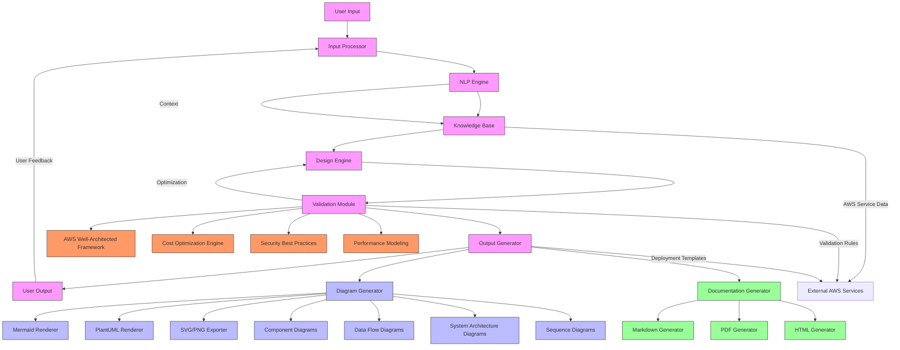
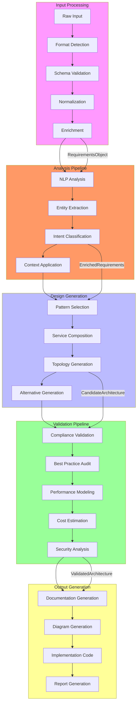
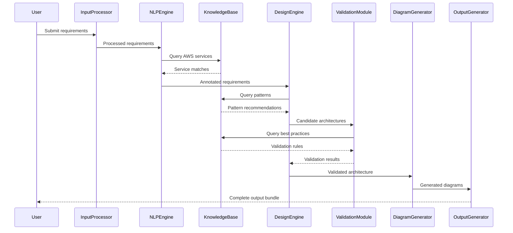
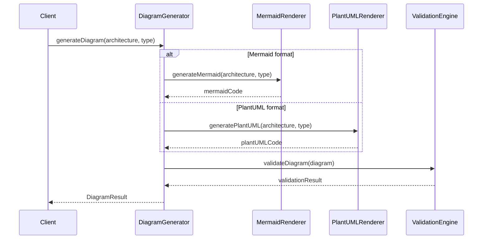
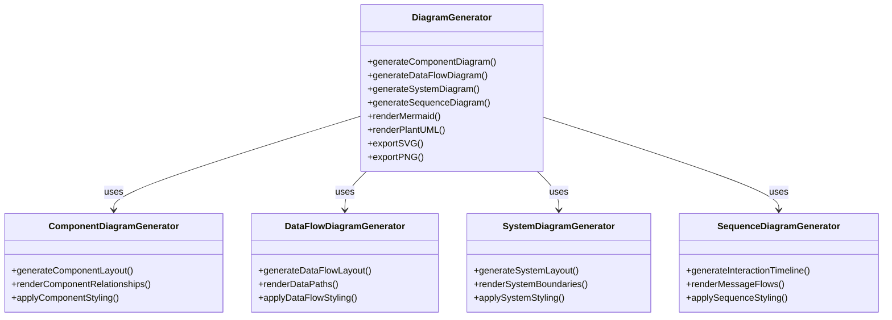
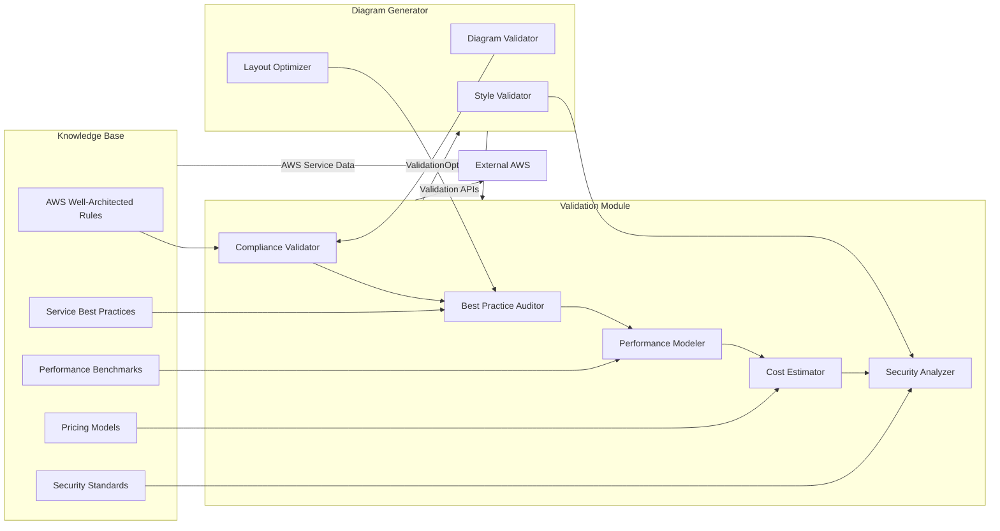
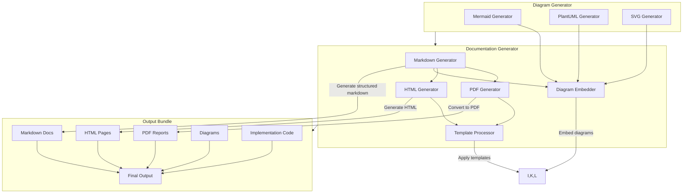
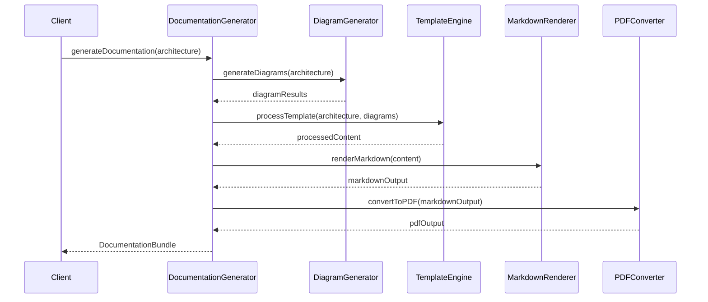
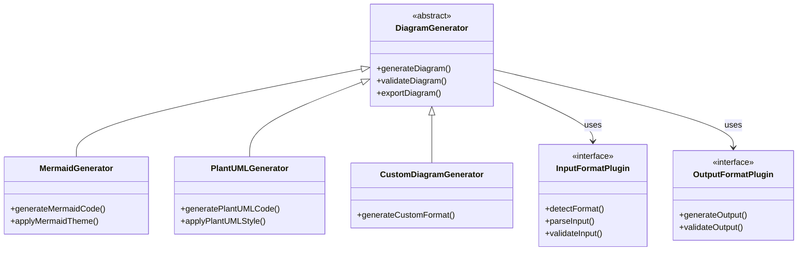

# AWS Architecture Agent - Core Architecture Diagram Generation System

## 1. Comprehensive System Architecture Diagram



## 2. Data Flow Between Components

### 2.1 Input Processing → Analysis → Diagram Generation → Validation → Output



## 3. Core Interfaces and Data Structures

### 3.1 Input Processor Interface
```typescript
interface InputProcessor {
    detectFormat(input: string): { format: InputFormat, confidence: number };
    validate(input: string, format: InputFormat): ValidationResult;
    normalize(input: string, format: InputFormat): RequirementsObject;
    enrich(requirements: RequirementsObject): EnrichedRequirements;
    handleErrors(errors: ValidationError[]): PartialRequirements | ErrorResponse;
}
```

### 3.2 Diagram Generator Interface
```typescript
interface DiagramGenerator {
    generateArchitectureDiagram(
        architecture: ValidatedArchitecture,
        type: DiagramType,
        options: DiagramOptions
    ): DiagramResult;

    generateComponentDiagram(
        components: AWSComponent[],
        relationships: ComponentRelationship[]
    ): MermaidDiagram;

    generateDataFlowDiagram(
        dataFlows: DataFlow[],
        services: AWSService[]
    ): MermaidDiagram;

    generateSequenceDiagram(
        interactions: ComponentInteraction[],
        timeline: InteractionTimeline
    ): MermaidDiagram;
}
```

### 3.3 Core Data Structures
```typescript
// Input/Output Structures
interface RequirementsObject {
    project: string;
    requirements: {
        scalability?: string;
        availability?: string;
        performance?: PerformanceRequirements;
        security?: SecurityRequirements;
        compliance?: string[];
    };
    constraints: {
        budget?: string;
        timeline?: string;
        team_size?: string;
    };
    preferences?: {
        serverless?: boolean;
        multi_region?: boolean;
        database_type?: string;
    };
}

// Architecture Structures
interface CandidateArchitecture {
    id: string;
    name: string;
    pattern: ArchitecturalPattern;
    services: ArchitectureService[];
    topology: ArchitectureTopology;
    metadata: GenerationMetadata;
    diagrams: {
        component?: string;
        dataFlow?: string;
        system?: string;
        sequence?: string[];
    };
}

// Diagram Structures
interface DiagramResult {
    type: DiagramType;
    format: 'mermaid' | 'plantuml' | 'svg' | 'png';
    content: string;
    metadata: DiagramMetadata;
    validation: DiagramValidation;
}

interface MermaidDiagram {
    code: string;
    type: 'component' | 'dataFlow' | 'system' | 'sequence';
    theme?: string;
    direction?: 'TD' | 'LR' | 'BT' | 'RL';
}
```

## 4. Sequence Diagrams for Component Interactions

### 4.1 Architecture Generation Sequence


### 4.2 Diagram Generation Sequence


## 5. Architecture for Multiple Diagram Types Support

### 5.1 Diagram Type Architecture


### 5.2 Diagram Type Support Matrix

| Diagram Type | Mermaid Support | PlantUML Support | SVG/PNG Export | Key Features |
|--------------|----------------|-----------------|----------------|--------------|
| Component | ✅ Full | ✅ Full | ✅ | Service relationships, boundaries |
| Data Flow | ✅ Full | ✅ Full | ✅ | Data movement, processing steps |
| System | ✅ Full | ✅ Full | ✅ | High-level architecture |
| Sequence | ✅ Full | ✅ Full | ✅ | Component interactions, timelines |

## 6. AWS Best Practices Validation Integration

### 6.1 Validation Integration Architecture


### 6.2 Validation Workflow
```typescript
interface AWSValidationEngine {
    /**
     * Validates architecture against AWS Well-Architected Framework
     */
    validateWellArchitected(architecture: CandidateArchitecture): WellArchitectedResult;

    /**
     * Checks compliance with AWS security best practices
     */
    validateSecurity(architecture: CandidateArchitecture): SecurityValidationResult;

    /**
     * Validates cost optimization strategies
     */
    validateCostOptimization(architecture: CandidateArchitecture): CostValidationResult;

    /**
     * Validates diagram representation accuracy
     */
    validateDiagramAccuracy(diagram: DiagramResult, architecture: CandidateArchitecture): DiagramValidationResult;
}
```

## 7. Documentation Generation Workflow

### 7.1 Documentation Architecture


### 7.2 Documentation Generation Sequence


## 8. Robust, Extensible Architecture Design

### 8.1 Extensibility Points


### 8.2 Plugin Architecture for Extensibility
```typescript
interface DiagramGeneratorPlugin {
    /**
     * Plugin identifier
     */
    id: string;

    /**
     * Supported diagram types
     */
    supportedTypes: DiagramType[];

    /**
     * Generate diagram for specific type
     */
    generate(architecture: ValidatedArchitecture, type: DiagramType, options: any): DiagramResult;

    /**
     * Validate generated diagram
     */
    validate(diagram: DiagramResult, architecture: ValidatedArchitecture): ValidationResult;

    /**
     * Export diagram to specific format
     */
    export(diagram: DiagramResult, format: ExportFormat): ExportResult;
}

// Plugin Registration System
class DiagramGenerator {
    private plugins: DiagramGeneratorPlugin[] = [];

    registerPlugin(plugin: DiagramGeneratorPlugin): void {
        this.plugins.push(plugin);
    }

    generateDiagram(architecture: ValidatedArchitecture, type: DiagramType): DiagramResult {
        const plugin = this.plugins.find(p => p.supportedTypes.includes(type));
        if (!plugin) {
            throw new Error(`No plugin found for diagram type: ${type}`);
        }
        return plugin.generate(architecture, type, {});
    }
}
```

## 9. Implementation Roadmap

### 9.1 Phase 1: Core Architecture
- [x] Input Processor with multi-format support
- [x] NLP Engine for requirements analysis
- [x] Knowledge Base with AWS service catalog
- [x] Design Engine for architecture generation
- [x] Validation Module with AWS best practices
- [x] Basic Diagram Generator (Mermaid)

### 9.2 Phase 2: Enhanced Features
- [ ] Multiple diagram type support (Component, Data Flow, System, Sequence)
- [ ] PlantUML diagram generation
- [ ] SVG/PNG export capabilities
- [ ] Advanced validation integration
- [ ] Comprehensive documentation generation

### 9.3 Phase 3: Extensibility & Optimization
- [ ] Plugin architecture for custom diagram types
- [ ] Performance optimization for large architectures
- [ ] Advanced error handling and recovery
- [ ] CI/CD integration capabilities
- [ ] IDE plugin support

## 10. Key Design Principles

1. **Modularity**: Clear separation of concerns between components
2. **Extensibility**: Plugin architecture for future enhancements
3. **Validation Integration**: AWS best practices at every stage
4. **Multi-format Support**: Input/output flexibility
5. **Performance Optimization**: Efficient processing pipelines
6. **Error Resilience**: Graceful degradation and recovery
7. **Documentation Integration**: Comprehensive output generation
8. **Visual Consistency**: Standardized diagram styling across types

This architecture provides a robust foundation for the AWS architecture agent's diagram generation system, supporting multiple input formats, various diagram types, AWS best practices validation, and comprehensive documentation generation.