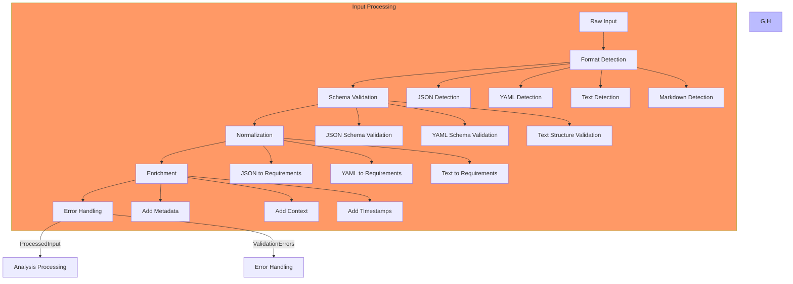
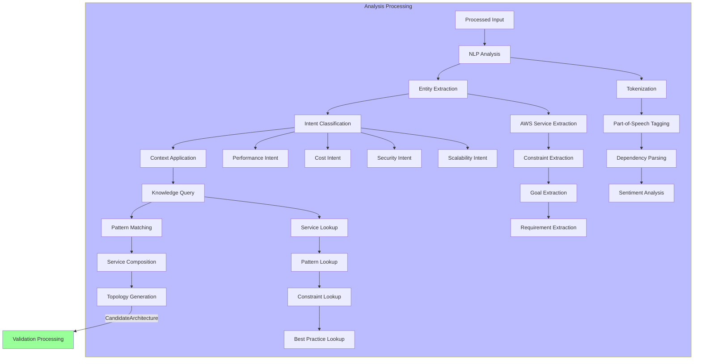
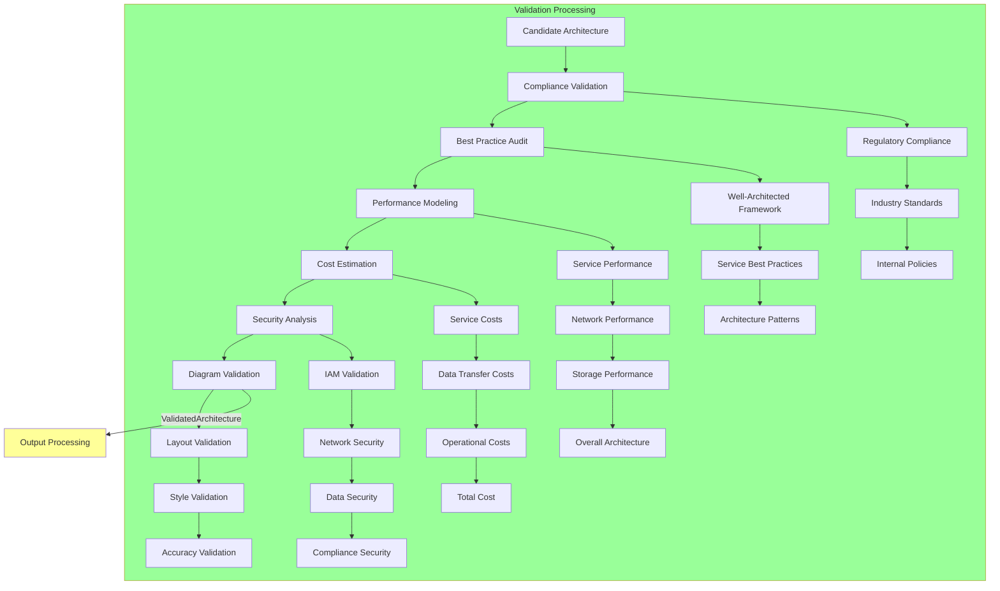
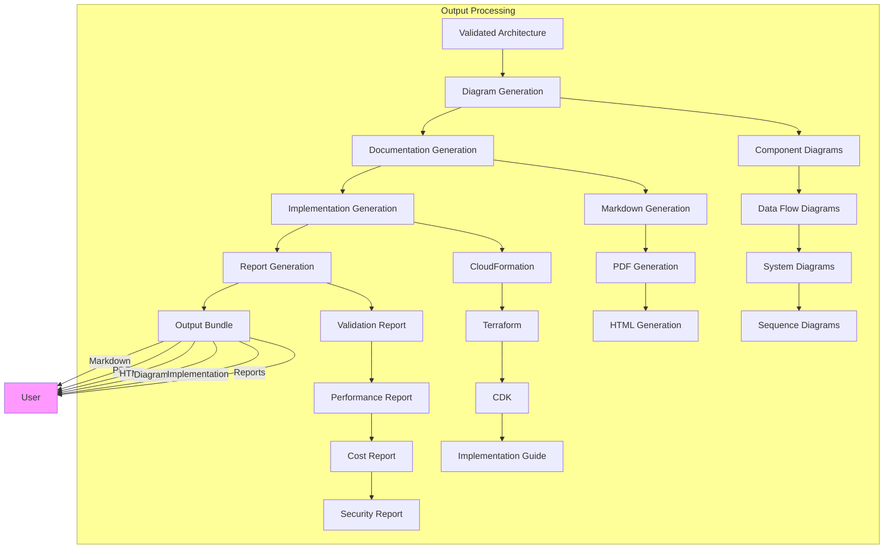
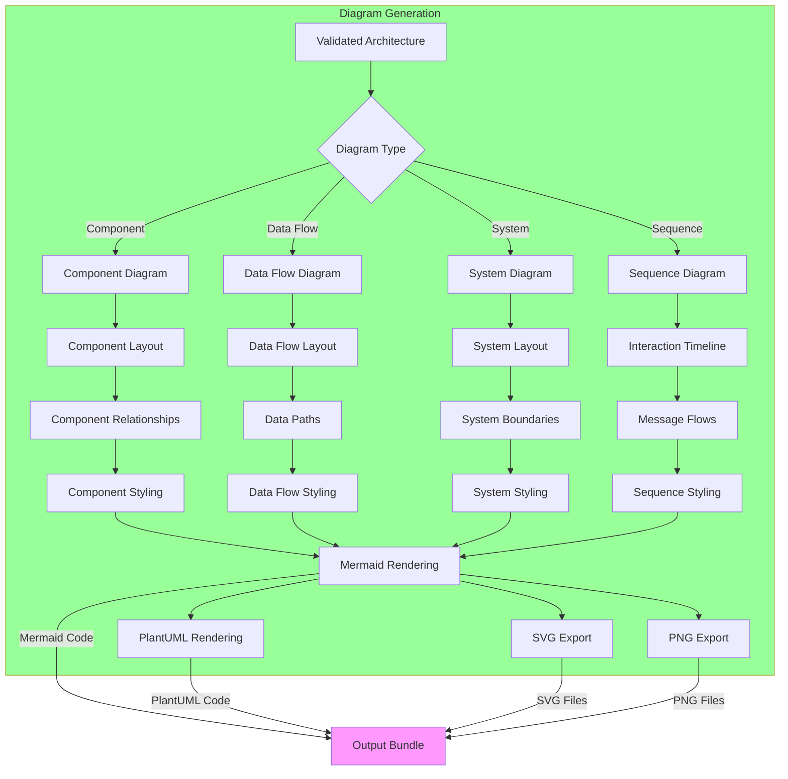
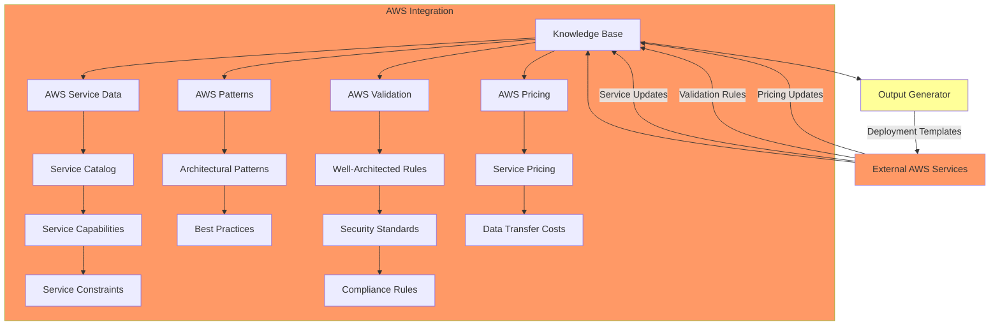
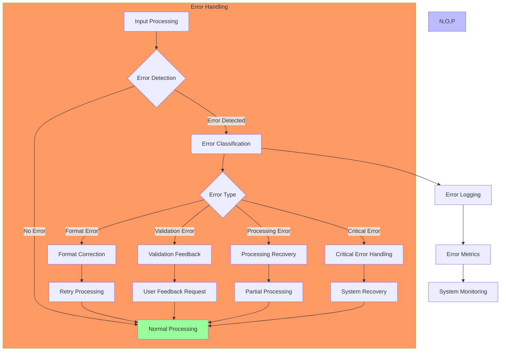
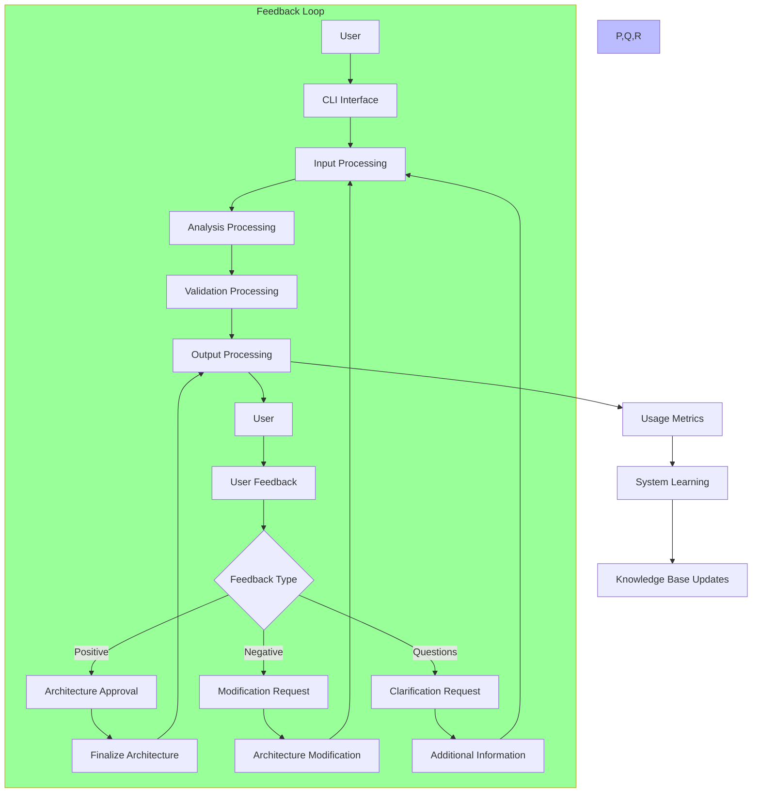
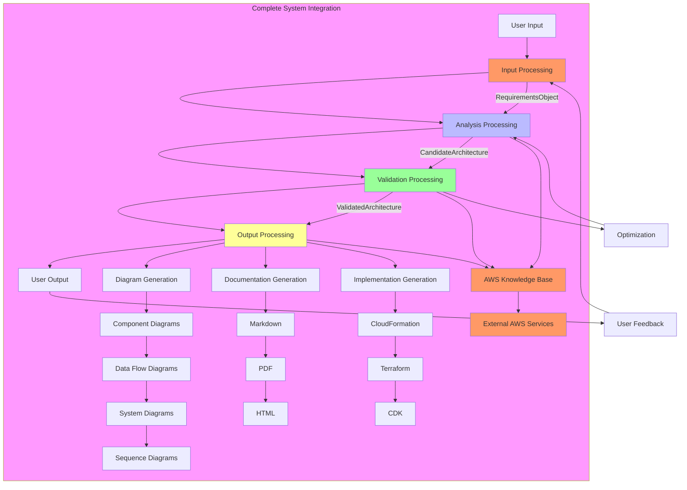

# AWS Architecture Agent - Data Flow Diagrams

## 1. Data Flow Diagram - System Overview

```mermaid
flowchart TD
    %% Main Data Flow
    subgraph SystemOverview[System Overview]
        A[User Input] --> B[Input Processing]
        B --> C[Analysis Processing]
        C --> D[Validation Processing]
        D --> E[Output Processing]
        E --> F[User Output]

        %% Input Processing Data Flow
        B --> B1[Format Detection]
        B1 --> B2[Schema Validation]
        B2 --> B3[Normalization]
        B3 --> B4[Enrichment]

        %% Analysis Processing Data Flow
        C --> C1[NLP Analysis]
        C1 --> C2[Entity Extraction]
        C2 --> C3[Intent Classification]
        C3 --> C4[Knowledge Query]
        C4 --> C5[Pattern Matching]
        C5 --> C6[Service Composition]
        C6 --> C7[Topology Generation]

        %% Validation Processing Data Flow
        D --> D1[Compliance Validation]
        D1 --> D2[Best Practice Audit]
        D2 --> D3[Performance Modeling]
        D3 --> D4[Cost Estimation]
        D4 --> D5[Security Analysis]
        D5 --> D6[Diagram Validation]

        %% Output Processing Data Flow
        E --> E1[Diagram Generation]
        E1 --> E2[Documentation Generation]
        E2 --> E3[Implementation Generation]
        E3 --> E4[Report Generation]
    end

    %% Data Structures Flow
    B4 -->|RequirementsObject| C1
    C3 -->|EnrichedRequirements| C4
    C7 -->|CandidateArchitecture| D1
    D6 -->|ValidatedArchitecture| E1

    %% Style
    style SystemOverview fill:#f9f
    style B,B1,B2,B3,B4 fill:#f96
    style C,C1,C2,C3,C4,C5,C6,C7 fill:#bbf
    style D,D1,D2,D3,D4,D5,D6 fill:#9f9
    style E,E1,E2,E3,E4 fill:#ff9
```

## 2. Data Flow Diagram - Input Processing

## 3. Data Flow Diagram - Analysis Processing

## 4. Data Flow Diagram - Validation Processing

## 5. Data Flow Diagram - Output Processing

## 6. Data Flow Diagram - Diagram Generation

## 7. Data Flow Diagram - AWS Integration

## 8. Data Flow Diagram - Error Handling

## 9. Data Flow Diagram - Feedback Loop

## 10. Data Flow Diagram - Complete System Integration

This comprehensive set of data flow diagrams provides detailed visual representations of the AWS Architecture Agent's data processing pipelines, covering input processing, analysis processing, validation processing, output processing, diagram generation, AWS integration, error handling, feedback loops, and complete system integration.